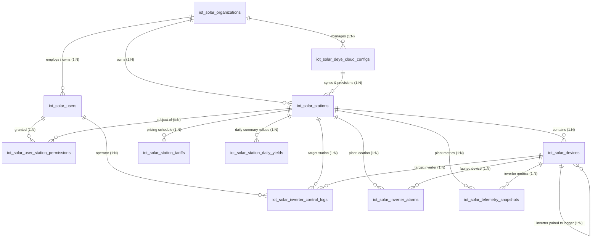

# IoT Solar Subsystem: Database Schema & Entity Relationships

This document outlines the architecture, table purposes, and relational structure for the **Deye Solar Monitoring Subsystem** (`iot_solar_*` schema, managed via Directus / MySQL).

---

## 1. High-Level Architecture & Overview

The database uses a **normalized schema** (prefixed with `iot_solar_*`) designed for multi-tenant solar fleet management, DeyeCloud OpenAPI synchronization, remote inverter control dispatch, time-series telemetry snapshots, and Time-of-Use (TOU) yield arbitrage.

### Are the tables related to each other?
**Yes, heavily.** The tables are linked by logical and relational foreign keys, many-to-many permission mappings, hardware telemetry associations, and audit trails.

### Entity Relationship Diagram (ERD)

---

## 2. Table-by-Table Purpose and Relationships

### 1. `iot_solar_organizations`
* **Purpose:** Multi-tenant / enterprise organization container (e.g. solar EPC contractors, commercial facility owners, industrial asset managers).
* **Primary Key:** `id` (INT / BIGINT Auto-Increment) or `uuid` (CHAR(36))
* **Key Columns:**
  * `id`: Unique organization identifier.
  * `name`: Company or entity title (e.g., *"Men2 Solar Industrial EPC"*).
  * `code`: Unique enterprise slug/code.
  * `contact_email`, `contact_phone`: Primary operational contacts.
  * `is_active`: Status flag (1 = Active, 0 = Suspended).
* **Relations to Other Tables:**
  * **To `iot_solar_users` (1-to-Many):** One organization employs multiple users (`iot_solar_users.org_id`).
  * **To `iot_solar_deye_cloud_configs` (1-to-Many):** One organization can register multiple DeyeCloud developer API gateway accounts (`iot_solar_deye_cloud_configs.org_id`).
  * **To `iot_solar_stations` (1-to-Many):** One organization owns multiple solar plants (`iot_solar_stations.org_id`).

---

### 2. `iot_solar_users`
* **Purpose:** System accounts for portal authentication, authorization, and role-based access control (RBAC). Roles include `admin`, `fleet_manager`, `site_engineer`, and `consumer`.
* **Primary Key:** `id` (INT Auto-Increment)
* **Key Columns:**
  * `id`: Internal user ID.
  * `org_id`: Parent organization FK.
  * `email`, `username`: Unique login credentials.
  * `password_hash`: Password or cryptographic hash.
  * `full_name`: User's display name.
  * `role`: RBAC permission level (`admin`, `fleet_manager`, `site_engineer`, `consumer`).
  * `is_active`: Account access switch.
  * `last_login_at`: Timestamp of latest session.
* **Relations to Other Tables:**
  * **Borrowed from `iot_solar_organizations`:** `org_id` references `iot_solar_organizations.id`.
  * **To `iot_solar_user_station_permissions` (1-to-Many):** Specifies which plants this user can view or control.
  * **To `iot_solar_inverter_control_logs` (1-to-Many):** Captures who triggered a remote workmode or battery parameter command (`iot_solar_inverter_control_logs.user_id`).

---

### 3. `iot_solar_deye_cloud_configs`
* **Purpose:** Stores DeyeCloud Developer OpenAPI integration credentials (e.g., App ID, App Secret, API Account Email, SHA256 hashed password, Base URL, cached bearer tokens, and rate limits). Represents developer gateway profiles that query the Deye upstream cloud.
* **Primary Key:** `id` (INT Auto-Increment)
* **Key Columns:**
  * `id`: Gateway profile identifier (mapped to `directusId` in frontend).
  * `org_id`: Owning organization FK.
  * `profile_name`: Friendly profile alias (e.g. *"Main Deye EU Developer Gateway"*).
  * `base_url`: Target regional API endpoint (e.g. `https://eu1-developer.deyecloud.com` or `https://api.deyecloud.com`).
  * `app_id`, `app_secret`: OAuth2 developer credentials from Deye Developer Portal.
  * `account_email`, `account_password`: Master account credentials for upstream token generation.
  * `cached_token`, `token_expires_at`: Active OpenAPI JWT token for request caching.
  * `rate_limit_max`, `rate_limit_used`: Dynamic rate-limiting quotas.
  * `status`: Health status (`OPTIMAL`, `DEGRADED`, `OFFLINE`).
* **Relations to Other Tables:**
  * **Borrowed from `iot_solar_organizations`:** `org_id` references `iot_solar_organizations.id`.
  * **To `iot_solar_stations` (1-to-Many):** Stations discovered under this developer account link back via `iot_solar_stations.deye_config_id`.

---

### 4. `iot_solar_stations`
* **Purpose:** Represents individual physical solar power plants / installation sites (e.g. `SP_04`, "Manila Warehouse Rooftop"). Stores geographic coordinates, nominal installed capacity (kW), electrical grid phase types, and active status.
* **Primary Key:** `id` (INT) / Unique natural key `station_id` (VARCHAR(64), Deye plant code).
* **Key Columns:**
  * `id`: Internal record ID.
  * `station_id`: Unique upstream Deye plant identifier (e.g., `'SP_04'`, `'PLANT_100293'`).
  * `org_id`: Enterprise organization FK.
  * `deye_config_id`: Deye OpenAPI config FK used to sync this plant.
  * `name`: Plant display name.
  * `installed_capacity_kw`: Total nominal PV panel DC capacity (e.g., `50.0` kW).
  * `address`, `city`, `country`: Physical location.
  * `latitude`, `longitude`: Geospatial location coordinates.
  * `grid_type`: Grid phase connection (`3-PHASE` or `SINGLE-PHASE`).
  * `is_active`: Operational toggle.
  * `last_synced_at`: Timestamp of latest metadata or device discovery sync.
* **Relations to Other Tables:**
  * **Borrowed from `iot_solar_organizations`:** `org_id` references `iot_solar_organizations.id`.
  * **Borrowed from `iot_solar_deye_cloud_configs`:** `deye_config_id` references `iot_solar_deye_cloud_configs.id`.
  * **To `iot_solar_devices` (1-to-Many):** Hardware installed at this plant reference `station_id`.
  * **To `iot_solar_user_station_permissions` (1-to-Many):** Plant access assignment for users.
  * **To `iot_solar_inverter_control_logs` (1-to-Many):** Target plant for control commands.
  * **To `iot_solar_inverter_alarms` (1-to-Many):** Equipment faults occurring at this site.
  * **To `iot_solar_station_tariffs` (1-to-Many):** Utility rate schedules for this plant.
  * **To `iot_solar_telemetry_snapshots` (1-to-Many):** Historical 5-minute telemetry logs.

---

### 5. `iot_solar_devices`
* **Purpose:** Represents physical IoT hardware equipment installed at a solar station (Hybrid Inverters, Solar Data Loggers / Wi-Fi dongles, Smart Energy Meters, Battery Energy Storage Systems [BESS]).
* **Primary Key:** `id` (INT) / Unique hardware key `device_sn` (VARCHAR(64), Hardware Serial Number).
* **Key Columns:**
  * `id`: Internal database ID.
  * `device_sn`: Unique physical serial number (e.g. `'2209X891104'`).
  * `station_id`: Parent solar station identifier.
  * `device_type`: Equipment classification (`INVERTER`, `LOGGER`, `BATTERY`, `METER`).
  * `name`: Custom device alias (e.g. *"50kW Three-Phase Hybrid Inverter #1"*).
  * `model`: Hardware model code (e.g. `'SUN-50K-SG01HP3-EU-AM2'`).
  * `rated_kw`: Rated AC output power in kW.
  * `logger_sn`: Paired data collector serial number (for inverters communicating through an external Wi-Fi/4G stick logger).
  * `firmware_version`: Inverter / DSP / ARM firmware version.
  * `status`: Equipment heartbeat status (`ONLINE`, `STANDBY`, `FAULT`, `OFFLINE`).
  * `last_seen_at`: Timestamp of latest data packet from logger.
* **Relations to Other Tables:**
  * **Borrowed from `iot_solar_stations`:** `station_id` references `iot_solar_stations.station_id`.
  * **Self-Referencing Pairing:** `logger_sn` references the `device_sn` of another device of type `LOGGER`.
  * **To `iot_solar_inverter_control_logs` (1-to-Many):** Audit log of workmode changes for this specific inverter.
  * **To `iot_solar_inverter_alarms` (1-to-Many):** Faults triggered by this hardware unit.
  * **To `iot_solar_telemetry_snapshots` (1-to-Many):** Inverter power, yield, and battery metrics.

---

### 6. `iot_solar_user_station_permissions`
* **Purpose:** Many-to-Many (M2M) authorization matrix connecting users to solar stations. Controls which consumers and site engineers can view specific plants, and whether they are authorized to execute remote inverter write commands or view financial/tariff reports.
* **Primary Key:** `id` (INT Auto-Increment)
* **Key Columns:**
  * `id`: Record ID.
  * `user_id`: Target user identifier.
  * `station_id`: Target solar plant identifier.
  * `can_control`: Boolean (1 = Authorized to dispatch inverter workmode/battery commands, 0 = Read-only).
  * `can_view_financials`: Boolean (1 = Can view electricity cost savings and tariff arbitrage revenue, 0 = Hidden).
* **Relations to Other Tables:**
  * **Borrowed from `iot_solar_users`:** `user_id` references `iot_solar_users.id` (ON DELETE CASCADE).
  * **Borrowed from `iot_solar_stations`:** `station_id` references `iot_solar_stations.station_id` (ON DELETE CASCADE).

---

### 7. `iot_solar_inverter_control_logs`
* **Purpose:** Immutable audit trail and command history tracking all remote dispatch operations sent to inverters via the DeyeCloud OpenAPI. Records the user who initiated the action, target inverter, mode change (`PEAK_SHAVING`, `BATTERY_FIRST`, `LOAD_FIRST`, `SELLING_FIRST`), JSON parameters payload, and upstream status.
* **Primary Key:** `id` (INT Auto-Increment)
* **Key Columns:**
  * `id`: Log entry ID.
  * `dispatched_at`: Timestamp when the command was sent.
  * `user_id`: User who authorized the dispatch (nullable for automated system policies).
  * `station_id`: Target station ID.
  * `device_sn`: Target inverter serial number.
  * `action`: Action description (e.g. `'SET_WORK_MODE_PEAK_SHAVING'`, `'ENABLE_GRID_CHARGE'`).
  * `work_mode`: Target inverter operational mode.
  * `parameters_payload`: JSON payload of requested register settings.
  * `status`: Command execution state (`PENDING`, `SUCCESS`, `REJECTED`, `FAILED`).
  * `upstream_code`, `upstream_message`: Direct response returned by DeyeCloud OpenAPI.
  * `client_ip`: Originating IP address of the operator for cybersecurity compliance.
* **Relations to Other Tables:**
  * **Borrowed from `iot_solar_users`:** `user_id` references `iot_solar_users.id` (ON DELETE SET NULL).
  * **Borrowed from `iot_solar_stations`:** `station_id` references `iot_solar_stations.station_id`.
  * **Borrowed from `iot_solar_devices`:** `device_sn` references `iot_solar_devices.device_sn`.

---

### 8. `iot_solar_inverter_alarms`
* **Purpose:** Real-time and historical fault alarm log. Captures grid overvoltage, phase loss, DC ground insulation faults, battery low voltage, and high inverter temperature alarms.
* **Primary Key:** `id` (INT Auto-Increment)
* **Key Columns:**
  * `id`: Alarm event ID.
  * `device_sn`: Serial number of the faulted equipment.
  * `station_id`: Plant location.
  * `alarm_code`: Hardware error code (e.g. `'F18'`, `'W03'`, `'E01'`).
  * `severity`: Alert severity level (`INFO`, `WARNING`, `CRITICAL`).
  * `title`: Alarm summary (e.g. *"DC Arc Fault Detected"*, *"Grid Loss / Anti-Islanding"*).
  * `description`: Remediation instructions or fault diagnosis.
  * `is_resolved`: Resolution status (1 = Cleared, 0 = Active Alarm).
  * `triggered_at`: Timestamp when fault was raised.
  * `resolved_at`: Timestamp when fault condition cleared.
* **Relations to Other Tables:**
  * **Borrowed from `iot_solar_stations`:** `station_id` references `iot_solar_stations.station_id`.
  * **Borrowed from `iot_solar_devices`:** `device_sn` references `iot_solar_devices.device_sn`.

---

### 9. `iot_solar_station_tariffs`
* **Purpose:** Stores Time-of-Use (TOU) electrical utility tariff schedules, peak rate windows, and feed-in export compensation rates. Enables the **Yield & Arbitrage** engine to calculate monetary savings and battery peak-shaving benefits.
* **Primary Key:** `id` (INT Auto-Increment)
* **Key Columns:**
  * `id`: Tariff record ID.
  * `station_id`: Plant associated with this utility contract.
  * `currency`: Currency code (e.g., `'USD'`, `'EUR'`, `'PHP'`).
  * `peak_rate`: Peak hour grid import cost per kWh (e.g. `$0.36/kWh`).
  * `off_peak_rate`: Off-peak grid import cost per kWh (e.g. `$0.14/kWh`).
  * `shoulder_rate`: Intermediate rate per kWh.
  * `feed_in_tariff`: Export compensation rate credited by utility (e.g. `$0.09/kWh`).
  * `peak_start_hour`, `peak_end_hour`: Time window defining peak electricity pricing (e.g. 14:00 to 20:00).
  * `effective_date`: Start date of current utility contract.
* **Relations to Other Tables:**
  * **Borrowed from `iot_solar_stations`:** `station_id` references `iot_solar_stations.station_id`.

---

### 10. `iot_solar_station_daily_yields`
* **Purpose:** Daily rollup / historical aggregation table. Stores frozen, end-of-day summary metrics per solar plant for each calendar day (`yield_date`). Powers monthly/yearly generation bar charts, lifetime ROI analysis, and historical reporting without needing to re-aggregate raw 5-minute telemetry streams.
* **Primary Key:** `id` (BIGINT Auto-Increment)
* **Key Columns:**
  * `id`: Internal record ID.
  * `station_id`: Parent solar station identifier (`VARCHAR(64)`).
  * `yield_date`: Calendar date for the daily yield report (`DATE`, format `YYYY-MM-DD`).
  * `solar_yield_kwh`: Total active solar PV electricity generated that day.
  * `consumed_kwh`: Total facility electricity consumed by machinery and loads.
  * `grid_export_kwh`: Surplus solar energy exported to utility grid.
  * `grid_import_kwh`: Nighttime or overcast energy imported from utility grid.
  * `battery_charge_kwh`: Total energy fed into BESS batteries.
  * `battery_discharge_kwh`: Total energy extracted from BESS batteries to serve loads.
  * `peak_power_kw`: Maximum instantaneous peak kW output reached on that day.
  * `cost_saved_usd`: Total monetary energy bill savings achieved on that day.
  * `co2_offset_ton`: Environmental equivalent carbon offset metric (tons CO₂).
  * `created_at`, `updated_at`: Timestamps of row creation/modification.
* **Relations to Other Tables:**
  * **Borrowed from `iot_solar_stations`:** `station_id` references `iot_solar_stations.station_id`.

> [!NOTE]
> **Why is `iot_solar_station_daily_yields` currently empty?**
> 1. **Live Direct-Fetch Model:** The DSM Next.js application is currently configured in real-time operational mode: it reads live daily yields on-the-fly directly from the Deye Cloud OpenAPI (`/v1.0/station/latest` and `/v1.0/device/batchLatest` register `DailyActiveProduction`).
> 2. **No Active Midnight Archival Cron:** Populating this table requires an automated end-of-day scheduler (e.g. running daily at 23:59 or 00:05) or a background ingestion worker to query the final daily yield numbers from Deye Cloud or aggregate `iot_solar_telemetry_snapshots` and write the summary record.
> 3. **Unregistered in Collection Writer:** In the DSM codebase, the API client currently writes newly discovered stations, devices, and control audit logs, but does not yet run an automated end-of-day batch insert into `iot_solar_station_daily_yields`.

---

### 11. `iot_solar_telemetry_snapshots`
* **Purpose:** High-resolution time-series data table recording 5-minute sampling intervals of solar generation, load consumption, battery charge/discharge, grid import/export, and AC 3-phase voltages. Powers the **Trigonometric History Curves** and **Harmonics Analysis** dashboards.
* **Primary Key:** `id` (BIGINT Auto-Increment)
* **Key Columns:**
  * `id`: Snapshot row ID.
  * `station_id`: Associated solar station.
  * `device_sn`: Associated inverter serial number.
  * `timestamp`: Sampling timestamp (5-minute aligned intervals).
  * `pv_power_kw`: Instantaneous solar PV production.
  * `load_power_kw`: Instantaneous facility load consumption.
  * `grid_power_kw`: Net utility grid power (+ Export / - Import).
  * `battery_power_kw`: Battery power (+ Charge / - Discharge).
  * `battery_soc`: State of Charge percentage (0 - 100%).
  * `daily_yield_kwh`: Cumulative active production for the current day.
  * `total_yield_mwh`: Cumulative lifetime plant generation.
  * `grid_voltage_l1`, `grid_voltage_l2`, `grid_voltage_l3`: Three-phase RMS AC voltages for phasor trigonometry.
* **Relations to Other Tables:**
  * **Borrowed from `iot_solar_stations`:** `station_id` references `iot_solar_stations.station_id`.
  * **Borrowed from `iot_solar_devices`:** `device_sn` references `iot_solar_devices.device_sn`.

---

### 12. `iot_solar_accounts` (Legacy / Monolithic Collection)
* **Purpose:** Backward-compatibility collection used prior to database normalization. Stores monolithic records containing credentials, API keys, and nested JSON plant arrays.
* **Role in Current System:** The system operates a seamless fallback mechanism: it first queries the normalized tables (`iot_solar_deye_cloud_configs`, `iot_solar_stations`, `iot_solar_devices`), and if empty, automatically falls back to `iot_solar_accounts` or `deye-accounts.json`.

---

## 3. Comprehensive Foreign Key & Data Dependency Matrix

| Child Table | Foreign Key Column | Parent (Referenced) Table | Referenced Column | Relationship | Purpose / Behavior |
| :--- | :--- | :--- | :--- | :--- | :--- |
| `iot_solar_users` | `org_id` | `iot_solar_organizations` | `id` | Many-to-One | Associates users with an organization tenant |
| `iot_solar_deye_cloud_configs` | `org_id` | `iot_solar_organizations` | `id` | Many-to-One | Associates Deye OpenAPI gateway accounts with an organization |
| `iot_solar_stations` | `org_id` | `iot_solar_organizations` | `id` | Many-to-One | Identifies plant ownership |
| `iot_solar_stations` | `deye_config_id` | `iot_solar_deye_cloud_configs` | `id` | Many-to-One | Connects plant to the API developer account used to fetch telemetry |
| `iot_solar_devices` | `station_id` | `iot_solar_stations` | `station_id` | Many-to-One | Assigns hardware devices (inverters/loggers) to a solar plant |
| `iot_solar_devices` | `logger_sn` | `iot_solar_devices` | `device_sn` | Many-to-One (Self) | Pairs an inverter with its communication stick logger |
| `iot_solar_user_station_permissions` | `user_id` | `iot_solar_users` | `id` | Many-to-One | Identifies user receiving plant access |
| `iot_solar_user_station_permissions` | `station_id` | `iot_solar_stations` | `station_id` | Many-to-One | Identifies solar plant accessible to user |
| `iot_solar_inverter_control_logs` | `user_id` | `iot_solar_users` | `id` | Many-to-One | Records operator responsible for remote command |
| `iot_solar_inverter_control_logs` | `station_id` | `iot_solar_stations` | `station_id` | Many-to-One | Records plant context for command audit |
| `iot_solar_inverter_control_logs` | `device_sn` | `iot_solar_devices` | `device_sn` | Many-to-One | Records target hardware inverter |
| `iot_solar_inverter_alarms` | `station_id` | `iot_solar_stations` | `station_id` | Many-to-One | Identifies plant site of alarm |
| `iot_solar_inverter_alarms` | `device_sn` | `iot_solar_devices` | `device_sn` | Many-to-One | Identifies specific faulted device |
| `iot_solar_station_tariffs` | `station_id` | `iot_solar_stations` | `station_id` | Many-to-One | Maps utility pricing structure to a solar plant |
| `iot_solar_station_daily_yields` | `station_id` | `iot_solar_stations` | `station_id` | Many-to-One | Links daily frozen yield rollup statistics to a solar plant |
| `iot_solar_telemetry_snapshots` | `station_id` | `iot_solar_stations` | `station_id` | Many-to-One | Groups time-series curves by plant |
| `iot_solar_telemetry_snapshots` | `device_sn` | `iot_solar_devices` | `device_sn` | Many-to-One | Groups time-series curves by inverter |

---

## 4. Primary System Workflows Using These Relations

### A. Authentication & Access Delegation
1. A user logs in with email and password via `/api/auth/role`.
2. The system checks `iot_solar_users` to verify credentials and determine role (`admin` vs `consumer`).
3. For `consumer` users, the system inspects `iot_solar_user_station_permissions` matching `user_id` to locate their assigned `station_id`.
4. The dashboard restricts views to only stations the user is permitted to see.

### B. Fleet Hardware Discovery & Polling
1. The background manager reads active API credentials from `iot_solar_deye_cloud_configs`.
2. It calls DeyeCloud OpenAPI (`/v1.0/station/list`) and synchronizes discovered stations into `iot_solar_stations` (setting `deye_config_id`).
3. For each station, it queries device lists (`/v1.0/device/list`) and populates `iot_solar_devices` (linking each device by `station_id` and pairing inverters to loggers via `logger_sn`).

### C. Remote Inverter Control & Audit Trail
1. An authorized user triggers a work mode change (e.g. `PEAK_SHAVING` or enabling grid charge) via `/api/deye/control`.
2. The backend sends the command upstream via the Deye Cloud OpenAPI.
3. An audit log is written immediately into `iot_solar_inverter_control_logs` containing `user_id`, `station_id`, `device_sn`, `action`, payload, status, and client IP address.

### D. Yield & Arbitrage Calculations
1. 5-minute sampling records from `iot_solar_telemetry_snapshots` track production and grid import/export.
2. The arbitrage engine joins with `iot_solar_station_tariffs` matching `station_id` to evaluate peak vs off-peak consumption, calculating avoided peak utility costs.
